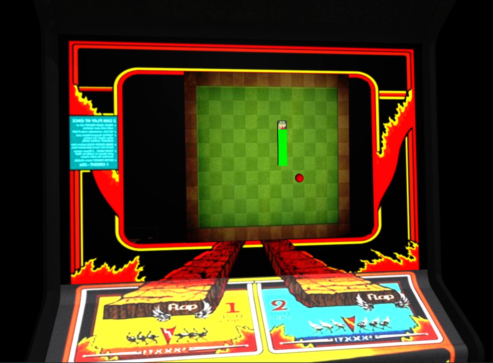

# Three.JS 3D立體貪吃蛇小遊戲
電腦繪圖與視覺模擬期末程式專案
## 安裝
` npm install`
## 執行程式
` npm run dev `
## 遊戲邏輯
> 使用WASD/上下左右 來操作貪吃蛇
> 如貪吃蛇吃到獎勵 則尾端將會增加長度
## 遊戲截圖

## 參考資料
+ project: https://github.com/SuboptimalEng/gamedex
+ game console 3D model: https://sketchfab.com/3d-models/joust-console-9b1648c89bad4a7b8a01a3cdfcf00550